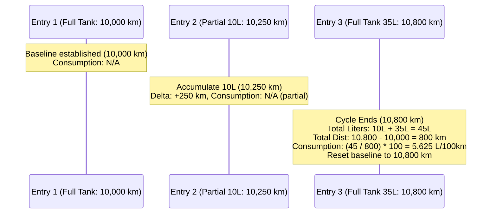

# Vehicle Fuel Metrics & Dynamic Calculation Guide

## Overview

This document details the algorithm, computational complexity, mathematical formulas, and pagination strategies for computing fuel efficiency and distance metrics in the Vehicles domain of `finance-tracker-api`.

Rather than persisting redundant calculated fields in the database (which creates data integrity hazards when historical records are updated, backfilled, or deleted), **the database stores only the raw refueling events**, while all derived metrics are computed **on-the-fly** via a pure domain helper.

---

## 1. Raw Stored Attributes vs. Derived Metrics

### Raw Input Fields (Stored in MongoDB `VehicleFuelEntry`)
* `date`: Refueling timestamp (Date)
* `odometerKm`: Total odometer reading at fill-up (integer, km)
* `fuelLiters`: Fuel volume pumped (positive number, liters)
* `isFullTank`: Whether the vehicle was filled to full capacity (boolean)
* `unitPricePln`: Price per liter in PLN (positive number)
* `costPln`: Total cost of the fill-up in PLN (positive number)
* `stationBrand` / `stationAddress`: Gas station metadata (optional)
* `description`: User notes (optional)
* `transactionId`: Foreign key to financial `Transaction` (optional)
* `sourceRow`: CSV row index for idempotent imports (optional)

### Derived Metrics (Computed On-the-Fly)
* `distanceSincePreviousKm`: Delta odometer between consecutive entries ($O_i - O_{i-1}$).
* `distanceSincePreviousFullKm`: Delta odometer between the current full tank and the preceding full tank benchmark ($O_{\text{full}} - O_{\text{prev\_full}}$).
* `fuelLitersToFull`: Accumulated fuel liters pumped across all fill-ups within the full-tank cycle ($\sum L$).
* `costToFullPln`: Accumulated cost in PLN across all fill-ups within the full-tank cycle ($\sum C$).
* `consumptionLPer100Km`: Average fuel consumption in $L/100\text{km}$ ($\frac{\sum L}{\Delta O_{\text{full}}} \times 100$).
* `costPerKmPln`: Average fuel cost per kilometer in $\text{PLN/km}$ ($\frac{\sum C}{\Delta O_{\text{full}}}$).
* `kmPerLiter`: Distance traveled per liter of fuel in $\text{km/L}$ ($\frac{\Delta O_{\text{full}}}{\sum L}$).

---

## 2. The Full-Tank Benchmark Algorithm

### Core Concept: Consumption Cycles
A reliable fuel consumption measurement requires knowing the exact volume of fuel used over a known distance. In consumer vehicles without telemetry sensors, **a full tank is the only reliable benchmark**.
* When a vehicle is filled partially (`isFullTank = false`), the exact remaining fuel is unknown. Fuel liters and cost accumulate.
* When the vehicle is next filled to full (`isFullTank = true`), the total accumulated fuel represents exactly the amount burned since the last full tank benchmark.
* Once calculated, the accumulator resets, and the current full-tank odometer becomes the new baseline.



### TypeScript Reference Implementation

```typescript
export interface RawFuelEntry {
  _id: string;
  vehicleId: string;
  date: Date;
  odometerKm: number;
  fuelLiters: number;
  isFullTank: boolean;
  unitPricePln: number;
  costPln: number;
  stationBrand?: string;
  stationAddress?: string;
  description?: string;
  transactionId?: string | null;
}

export interface EnrichedFuelEntry extends RawFuelEntry {
  distanceSincePreviousKm: number | null;
  distanceSincePreviousFullKm: number | null;
  fuelLitersToFull: number | null;
  costToFullPln: number | null;
  consumptionLPer100Km: number | null;
  costPerKmPln: number | null;
  kmPerLiter: number | null;
}

/**
 * Pure helper function to enrich sorted fuel entries with distance & consumption metrics.
 * Complexity: O(N) single-pass iteration.
 */
export function enrichFuelEntries(sortedEntries: RawFuelEntry[]): EnrichedFuelEntry[] {
  let lastOdometer: number | null = null;
  let lastFullTankOdometer: number | null = null;
  let accumulatedLiters = 0;
  let accumulatedCost = 0;

  return sortedEntries.map((entry) => {
    // 1. Delta distance since immediately preceding refuel
    const distanceSincePreviousKm =
      lastOdometer !== null && entry.odometerKm >= lastOdometer
        ? entry.odometerKm - lastOdometer
        : null;

    // Accumulate fuel & cost for the current full-tank cycle
    accumulatedLiters += entry.fuelLiters;
    accumulatedCost += entry.costPln;

    let distanceSincePreviousFullKm: number | null = null;
    let fuelLitersToFull: number | null = null;
    let costToFullPln: number | null = null;
    let consumptionLPer100Km: number | null = null;
    let costPerKmPln: number | null = null;
    let kmPerLiter: number | null = null;

    if (entry.isFullTank) {
      if (lastFullTankOdometer !== null && entry.odometerKm > lastFullTankOdometer) {
        distanceSincePreviousFullKm = entry.odometerKm - lastFullTankOdometer;
        fuelLitersToFull = Math.round(accumulatedLiters * 100) / 100;
        costToFullPln = Math.round(accumulatedCost * 100) / 100;

        consumptionLPer100Km =
          Math.round(((accumulatedLiters / distanceSincePreviousFullKm) * 100) * 100) / 100;
        costPerKmPln =
          Math.round((accumulatedCost / distanceSincePreviousFullKm) * 100) / 100;
        kmPerLiter =
          Math.round((distanceSincePreviousFullKm / accumulatedLiters) * 100) / 100;
      }

      // Reset cycle accumulator and update full-tank baseline
      lastFullTankOdometer = entry.odometerKm;
      accumulatedLiters = 0;
      accumulatedCost = 0;
    }

    lastOdometer = entry.odometerKm;

    return {
      ...entry,
      distanceSincePreviousKm,
      distanceSincePreviousFullKm,
      fuelLitersToFull,
      costToFullPln,
      consumptionLPer100Km,
      costPerKmPln,
      kmPerLiter,
    };
  });
}
```

---

## 3. Computational & Memory Cost Analysis

| Metric | Real-World Value | Impact |
|---|---|---|
| **Entries per Vehicle** | 20–50 / year $\rightarrow$ **150–500 over vehicle lifetime** | Very small dataset |
| **Memory Footprint** | ~500 objects $\approx$ **60–90 KB in RAM** | Completely negligible |
| **Algorithm Complexity** | **$O(N)$ Time**, **$O(N)$ Space** | Single linear scan |
| **Execution Time in V8** | **$< 0.2\text{ ms}$** (200 microseconds) | Imperceptible to API latency |
| **MongoDB Query Time** | **2–5 ms** (indexed by `{ ownerId: 1, vehicleId: 1, date: 1 }`) | Standard fast index scan |

### Why On-the-Fly Beats Database Denormalization
1. **Zero Cascade Invalidation**: If a user corrects a typo in an entry from 2 years ago (or inserts a missed receipt), stored denormalized values in every subsequent entry would become corrupted unless a complex transactional cascade update is run.
2. **Normalized DB**: Database documents stay compact, simple, and contain only authoritative user-entered data.
3. **No Migration Overhead**: If calculation formulas or rounding rules are updated in the future, zero database migrations are required.

---

## 4. Edge Cases & Resilience

1. **Consecutive Partial Fill-Ups**:
   - Accumulator sums liters and costs across multiple partial fill-ups ($10L + 15L + 20L$).
   - When the vehicle is finally filled to full tank, the full aggregated sum is divided by the total distance traversed since the last full tank.
2. **First Vehicle Refuel**:
   - `lastFullTankOdometer` is `null`. The first fill-up acts as the initial benchmark anchor, so its consumption is `null`.
3. **Odometer Rollover or Inverted Records**:
   - If `entry.odometerKm < lastOdometer` (e.g., dial rollover or faulty entry), deltas return `null` instead of negative numbers.
4. **Multiple Refuels on the Same Day**:
   - Sorting by `{ date: 1, odometerKm: 1 }` guarantees precise chronological order.

---

## 5. Pagination & Date Filtering Strategy

When an API client requests a paginated page (e.g. `page=2`, `limit=20`) or a date filter (e.g. `2024-06-01` to `2024-06-30`), standard database `skip`/`limit` cannot be used in isolation because an isolated subset loses the preceding baseline odometer and fuel accumulator.

### Recommended Pattern: In-Memory Windowing
Because a single vehicle's lifetime records are small ($< 1,000$ documents):
1. **Fetch All Entries for Vehicle**:
   ```typescript
   const rawEntries = await VehicleFuelEntryModel.find({
     ownerId,
     vehicleId,
   }).sort({ date: 1, odometerKm: 1 }).lean();
   ```
2. **Compute Derived Stream**:
   ```typescript
   const enriched = enrichFuelEntries(rawEntries);
   ```
3. **Apply Query Filters & Slice Window**:
   - Filter by date range (if `startDate` / `endDate` provided).
   - Filter by `isFullTank` (if provided).
   - Reverse for newest-first display.
   - Return `{ items: enriched.slice(offset, offset + limit), totalCount: enriched.length, page, limit }`.

Total end-to-end endpoint execution time remains **$< 10\text{ ms}$**.
